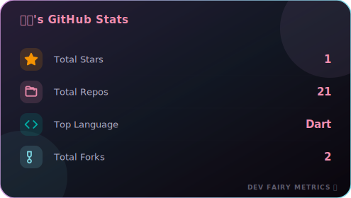

# Dev Fairy Metrics

Dev Fairy Metrics is an interactive dashboard and automated utility designed to generate highly customizable, fairy-themed GitHub Profile README cards. It provides visually stunning metrics cards for user stats and language breakdowns, featuring custom color palettes, multiple layouts, and responsive elements.

Users can configure their cards directly on a Next.js web application or automate the SVG updates with a scheduled GitHub Actions workflow.

---

## Preview

Here are examples of the cards generated using the **Dark Fairy** theme:

### Stats Card Layouts

#### Classic Layout
<p align="center">
  
</p>

#### Gamified RPG Layout
<p align="center">
  
</p>

### Languages Card Layouts

#### Donut Layout (Fairy Bars)
<p align="center">
  
</p>

#### Affinity Layout (Magic Circle)
<p align="center">
  
</p>

#### Compact Layout (Candy Compact)
<p align="center">
  
</p>

---

## Key Features

- **Tailored Theming**: Light and dark themes designed with custom HSL colors (Cotton Candy, Strawberry, Lavender, Mint, Peach, and Dark Fairy).
- **Two Card Templates**:
  - **Stats Card**: Classic format or a gamified RPG-style layout.
  - **Languages Card**: Visual breakdown of your top programming languages.
- **Multiple Layout Modes**: Donut charts, normal progress bars, compact grids, and custom circular affinity charts.
- **Dual Operations**:
  - **Interactive Web App**: Tweak card options in real-time, view changes instantly, and copy Markdown/HTML codes.
  - **Automated Workflow**: Run the generator script via GitHub Actions to update SVGs automatically and commit them to an output branch.

---

## Technical Stack

- **Core**: Next.js 15 (App Router), React 19, TypeScript
- **Styling**: Tailwind CSS & custom Vanilla CSS HSL variables
- **Animation**: Framer Motion
- **Components**: Radix UI (Tooltip primitives), Lucide Icons
- **SVG Generation**: Node.js filesystem and XML builder

---

## Getting Started

### Prerequisites

- Node.js 20.x or later
- npm, yarn, or pnpm

### Installation & Local Development

1. Clone the repository:
   ```bash
   git clone https://github.com/zzeeyyaa/dev-fairy-metrics.git
   cd dev-fairy-metrics
   ```

2. Install dependencies:
   ```bash
   npm install
   ```

3. Run the development server:
   ```bash
   npm run dev
   ```

4. Open [http://localhost:3000](http://localhost:3000) in your web browser.

---

## Automatic SVG Generation

The project includes `generate.mjs`, which runs locally or inside a CI/CD pipeline to fetch data from the GitHub API and generate static SVGs in the `output/` directory.

### Configuration (`config.json`)

Configure your username, theme, and card settings:

```json
{
  "username": "your-github-username",
  "theme": "dark-fairy",
  "stats": {
    "title": "My Custom Title",
    "hide_title": false,
    "hide_border": false
  },
  "languages": {
    "layout": "donut",
    "langs_count": 8,
    "hide_title": false,
    "hide_border": false
  }
}
```

### Run Locally

To test the generation script locally, create a `.env.local` file with your GitHub token to prevent rate limits:

```env
GITHUB_TOKEN=your_personal_access_token
```

Then execute the generation command:
```bash
node generate.mjs
```
The output SVGs will be placed in the `output/` folder.

---

## GitHub Actions Integration

Automate SVG updates on a schedule and commit them to your repository.

1. Ensure the GitHub Action file `.github/workflows/fairy-metrics.yml` exists in your repository.
2. In your repository settings, navigate to **Settings** > **Actions** > **General** > **Workflow permissions** and select **Read and write permissions**.
3. Create a Personal Access Token (PAT) with `repo` scope if you want to push to a separate branch, and add it as a repository secret named `PAT_TOKEN`. If not provided, it falls back to the default `GITHUB_TOKEN`.
4. The workflow runs every 12 hours or can be triggered manually. It builds the SVGs and pushes them to a branch named `output`.

### Linking the SVGs to your README

Once the Action runs and creates the `output` branch, you can reference the SVGs in your Profile README:

```markdown
<!-- Replace 'your-username' with your actual GitHub username -->
<p align="center">
  
  
</p>
```

---

## Directory Structure

```text
├── .github/workflows/    # CI/CD automation rules
├── app/                  # Next.js pages and layouts
├── components/           # UI cards and builders
├── hooks/                # Fetching and state management logic
├── lib/                  # Theme styling tokens
├── output/               # Destination folder for generated SVGs
├── config.json           # Action configuration file
└── generate.mjs          # SVG builder script
```

---

## License

This project is open-source and licensed under the MIT License.
